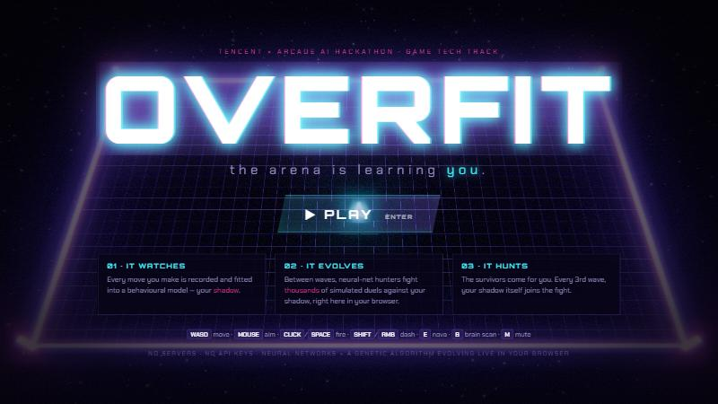
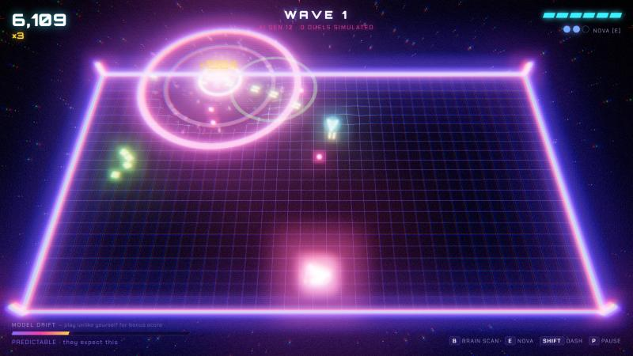
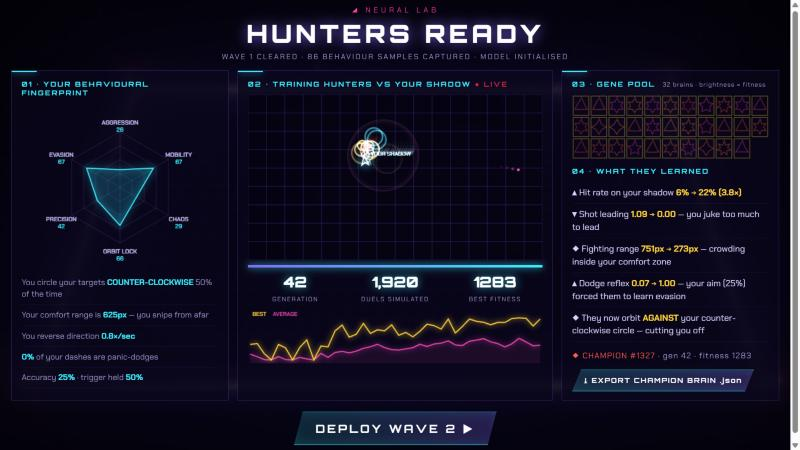
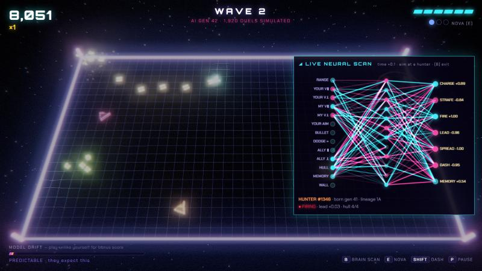

# OVERFIT — the arena is learning you

### ▶ [PLAY NOW](https://mohammad-umar7.github.io/game-tech-hackathon/) · 🎬 [TRAILER](https://mohammad-umar7.github.io/game-tech-hackathon/docs/overfit-demo.mp4) · 🤖 [WATCH AI vs AI](https://mohammad-umar7.github.io/game-tech-hackathon/?bot)

Runs in any modern browser, no install, no login, no API keys. Also works on phones with touch controls.



OVERFIT is a neon arena shooter where the enemies **train themselves against a clone of you**.

While you fight, the game builds a model of how you play: your favourite range, which way you circle, how often you change direction, when you panic-dash, how well you aim. Between waves it **trains its hunters against that model**, running thousands of simulated fights in your browser in about 5 seconds, then sends the winners after you. Every third wave, the clone itself (**SHADOW.EXE**) joins the fight, moving the way you move.

The only way to win is to **stop being predictable**. Playing in ways the model hasn't seen — **out of distribution** — breaks the enemies' learned tactics and boosts your score.

> Built for the **Tencent × Arcade AI Hackathon — Game Tech Track** (AI agents · simulation · production pipelines).

---

## The loop

| | |
|---|---|
|  | **1 · YOU FIGHT.** A 3D neon arena with bloom, colour-split, a spring grid that warps under every blast, 3D sparks bouncing off the floor, slow-motion and a soundtrack generated live. Each enemy hunter is a **neural network**, and its look (colour, number of spikes) comes from its genes, so you can *see* evolution happen. |
|  | **2 · IT LEARNS YOU.** The **Neural Lab** shows your behavioural fingerprint, then trains the hunters live against your shadow: about **2,000 simulated fights per wave**, shown with a fitness graph and a mini replay. Afterwards, test fights measure what changed in plain English: *"Hit rate on your shadow 3% → 5%"*, *"Shot leading 1.42 → 0.30 — you juke too much to lead"*. |
|  | **3 · LOOK INSIDE ITS HEAD.** Press **B** for a **live neural scan**: time slows to 10% and you watch a hunter's network fire in real time. Inputs (*your aim*, *bullet threat*, *range*…) flow to outputs (*charge*, *strafe*, *fire*, *lead*, *dash*). |

---

## What's under the hood

Everything is hand-written JavaScript: **no ML libraries, no server, no API keys.** Three.js is used only for rendering.

```
          ┌─────────────── LIVE ARENA (60 fps, Three.js) ───────────────┐
 you ───▶ │  player  ◀── bullets ──  hunters (13→12→7 tanh neural nets)  │
          └──────┬──────────────────────────────────────▲──────────────┘
                 │ 10 Hz behaviour samples              │ champion + elites
                 ▼                                      │
        ┌──────────────────┐   fitted model    ┌────────┴──────────────────┐
        │  PLAYER MODELER  │ ────────────────▶ │  HEADLESS DUEL SIMULATOR  │
        │  range · orbit · │   "your shadow"   │  3 hunters vs your shadow │
        │  jukes · dashes  │                   │  9 sim-seconds per fight  │
        │  aim · evasion   │                   │  32 genomes × 2 arenas    │
        └──────────────────┘                   │  × 30 generations / wave  │
                                               │  → genetic algorithm:     │
                                               │  elitism, tournament,     │
                                               │  neuron-block crossover,  │
                                               │  gaussian mutation        │
                                               └───────────────────────────┘
```

* **Shared code.** The real game and the training simulator run the *same* agent code (`js/agents.js`), so what the hunters learn in simulation carries straight into live play.
* **Inputs are relative to the target.** Each hunter sees the world from its own position facing its target (range, your movement toward/across it, your aim lined up on it, bullet threat and which side to dodge, nearest ally, memory). That keeps learning fast enough to visibly improve in a few seconds.
* **Behavioural cloning, cheaply.** The player model is a small set of numbers fitted from your play (preferred range and how firmly you keep it, which way you circle and how consistently, direction changes per second, dash triggers, dodge skill, accuracy). It drives both the training opponent and the SHADOW.EXE boss.
* **Explaining what they learned.** After training, we test the champion's network with fixed inputs and also measure it in fixed test fights against your shadow. That's how the game can say *what* it learned, not just that the fitness score went up.
* **Out-of-distribution meter.** We compare your last few seconds of play against the model the hunters trained on. Drift far enough and they visibly lose track of you, and your score multiplier rises.
* **Exportable brains.** In the Lab, **⤓ EXPORT CHAMPION BRAIN** downloads the winning network as JSON (layer sizes, input/output names, weights, and the player model it was trained against), ready to drop into any engine.

### Why it matters for studios
The same pipeline can be used as **adaptive enemy AI middleware**:
- **Per-player difficulty that adapts:** enemies that learn *this* player's habits rather than just getting more health.
- **Automated playtesting:** run thousands of simulated fights against clones of real players to find exploits (e.g. *"everyone circles counter-clockwise and the boss can't handle it"*).
- **Zero server cost:** training runs on the player's device in a few seconds per wave.

---

## Controls

| Desktop | |
|---|---|
| `WASD` / arrows | move |
| mouse | aim |
| click / `Space` | fire |
| `Shift` / right-click | dash (brief invulnerability) |
| `E` / `Q` | NOVA — screen-clearing shockwave |
| `B` | live neural scan (slow-mo) |
| `P` / `Esc` | pause · `M` mute |

**Touch:** drag on the left side to move; aiming and firing are automatic; on-screen buttons for DASH, NOVA and SCAN.

**AI vs AI:** open [`?bot`](https://mohammad-umar7.github.io/game-tech-hackathon/?bot) and an AI pilot plays by itself, hands-free, while the hunters keep evolving against *its* style. If it dies, it restarts.

**Trailer mode:** [`?autodemo`](https://mohammad-umar7.github.io/game-tech-hackathon/?autodemo) plays a captioned tour of the whole loop. `tools/record.mjs` records it to MP4 using headless Chrome's screencast and ffmpeg — that's how the trailer was made.

## Run locally
```bash
python -m http.server 5173
```
Then open http://localhost:5173. It's a static site with no build step.

## Files
| file | what |
|---|---|
| `js/nn.js` | neural net forward pass, genome, genetic algorithm, phenotype (looks from genes) |
| `js/agents.js` | hunter senses and actions, the shadow's policy, movement and dash physics (shared by game and trainer) |
| `js/playermodel.js` | behaviour recorder, model fitting, fingerprint, out-of-distribution meter |
| `js/trainer.js` | headless duel simulator, time-sliced trainer, network probes and "what they learned" text |
| `js/game.js` | live arena: waves, drones, SHADOW.EXE boss, combat, scoring |
| `js/render.js` · `js/fx3d.js` | Three.js scene, bloom + colour-split post-processing, particles, sparks, spring grid |
| `js/audio.js` | every sound effect and the music, synthesized with WebAudio (zero audio files) |
| `js/ui.js` · `js/main.js` | HUD, Neural Lab, brain scan, game flow, input |
